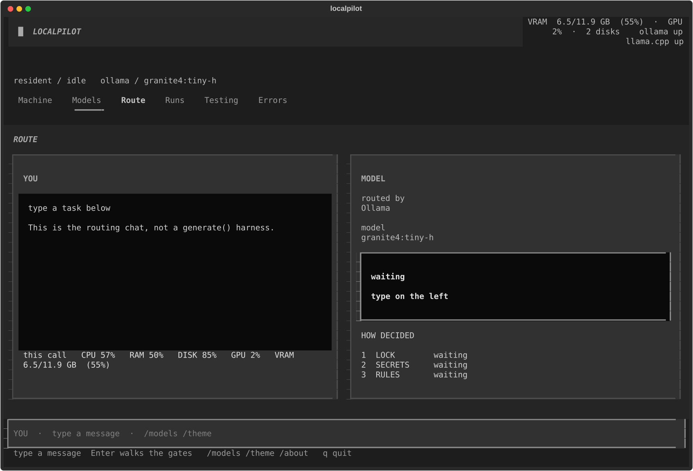

# LocalPilot

**Stay local unless the task actually needs the cloud.**

LocalPilot is a local-first router for people already running [Ollama](https://ollama.com) or [llama.cpp](https://github.com/ggerganov/llama.cpp). It walks seven gates and answers **LOCAL** or **CLOUD**, then shows which gate decided.

It is not another coding agent. It does not write your files. OpenCode, Hermes, Aider, and Cursor still own that work.



```powershell
python -m pip install -e .
localpilot
```

That opens the TUI. One-shot without the UI:

```powershell
localpilot route "Diagnose intermittent production deadlock in Postgres."
```

## The local problem

Once you have a local model, the hard part is not “run another harness.” It is this:

- some work should never leave the machine
- some work is too hard, too long, or too uncertain for the model you have loaded
- most tools hide that choice, or send everything to the cloud, or dump everything on one local model

LocalPilot turns that into routing. Same task in, a decision out, and a walk of the gates so you can see why.

## Where the idea came from

LocalPilot started on one PC that was already running Ollama and llama.cpp every day.

The first question was not “can we boost inference?” It was: can local-vs-cloud routing be as disciplined as a structured cloud router, but privacy-first, and measured on the machine in front of you?

What showed up fast:

- the bottleneck is often runtime behavior, not just model IQ — VRAM pressure, tail latency, hangs, broken JSON
- a wrapper around the same weights does not change the route; a different native model does
- a decision you cannot see is not useful

So the product became a **visible decision gate**, not a generate() loop and not an inference turbo. Typed LOCAL / CLOUD, plus which gate fired.

Other open-source routers exist (proxies, gateways, cost routers). LocalPilot’s focus is narrower: stay on your Ollama / llama.cpp box, decide in the open, keep the proof on the Route page.

## How it decides

Seven gates, in order:

1. **lock** — you already pinned a model
2. **secrets** — this should not leave the machine
3. **rules** — policy / two-axis risk (privacy vs capability)
4. **cheap** — a fast local classifier can take it
5. **LLM** — the locked router model classifies
6. **uncertain** — confidence is too low; escalate or hold
7. **result** — LOCAL or CLOUD, with the path written down

v0.1 talks to Ollama and llama.cpp on localhost. If those run in Docker or Podman and publish the ports, that already works. LocalPilot does not start containers.

## Privacy

LocalPilot does not phone home. No analytics, no crash reporter, no hardware upload.

If you want to help see how it behaves on other PCs, open a [Hardware report](https://github.com/paolothomas72/localpilot/issues/new?template=hardware.yml) and paste `localpilot doctor --json`. That is opt-in. Redact model names if you want.

## Quick start

```powershell
python -m pip install -e .
localpilot init --project .
localpilot probe --project .
localpilot route --project . "Review auth token changes for security issues."
```

Use llama.cpp explicitly:

```powershell
localpilot probe --project . --runtime llamacpp --model "<llama_server_model_name>"
localpilot route --project . --runtime llamacpp "Review auth token changes for security issues."
```

## Commands

| Command | What it does |
| --- | --- |
| `look` | six-page TUI (Machine, Models, Route, Runs, Testing, Errors) |
| `route` | one task → LOCAL / CLOUD and why (`--json` for the raw dict) |
| `doctor` | runtimes, VRAM, lock (`--json` prints a local snapshot; nothing is uploaded) |
| `models` | loaded vs available |
| `recommend` | hardware-aware local-model advice |
| `warmup` | cold-start the router so the first classify is not a hang |
| `unlock` | clear the single-model lock |
| `probe` | runtime + strict JSON classifier check |
| `benchmark` | labeled prompt suite → artifact JSON |
| `calibrate` | threshold from a benchmark (`safe` / `balanced`) |
| `export` | last Route decision → `runs/last-decision.json` |
| `version` / `about` / `update` | local version; `update` does not phone home |

## Runtime notes

- Ollama HTTP API (`/api/generate`)
- llama.cpp OpenAI-compatible API (`/v1/chat/completions`), default `http://127.0.0.1:8090`
- JSON output enforced, routing at `temperature=0`
- Two-axis policy can hard-route: capability risk → cloud, privacy risk → local
- Conflict mode: `privacy_first`, `capability_first`, or `model_decides`
- Low-confidence work can escalate from the router model to a fallback

Set `models.llamacpp_router` to the name your llama.cpp server exposes. If the server needs auth, set `llamacpp.api_key` in `localpilot.config.json` (that file stays on your machine and is not in this repo).

## Lab / benchmark

These are for measuring the router, not for first use.

```powershell
localpilot benchmark --project .
localpilot calibrate runs\benchmark-YYYYMMDDTHHMMSSZ.json --objective safe --max-escalation-rate 0.8 --out runs\calibration.json

python tools\run_test_pack_live.py --project .
python tools\generate_realistic_prompt_pack.py --out datasets\promptpack-realistic-v1.json --seed 42
python tools\split_dataset.py --in datasets\promptpack-realistic-v1.json --outdir datasets\splits-realistic-v1
python tools\run_multi_model_eval.py --project . --prompts datasets\splits\public_test.json --runs-per-model 3 --start-index 1 --end-index 10 --timeout-s 1200 --resume --out runs\multi-eval-public.json
python tools\build_leaderboard_report.py --in runs\multi-eval-public.json --out-md runs\leaderboard-public.md --out-json runs\leaderboard-public.json
python tools\build_benchmark_card.py --in runs\benchmark-YYYYMMDDTHHMMSSZ.json --title "LocalPilot Benchmark Card" --out-md runs\benchmark-card.md --out-json runs\benchmark-card.json
```

## License

MIT. See [LICENSE](LICENSE).
